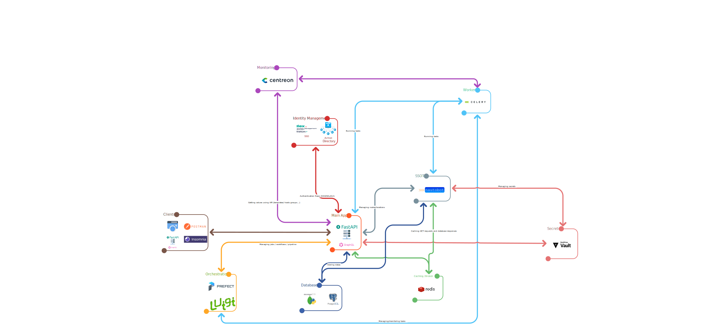

# FastAPI Sample Project

## Installation

You just need to setup a virtualenv and install the package, it will install all needed dependency and let you work when done.

## Architecture



## Development

```bash
pip install -e .[dev]
fastapi-test run --reload
```

You can also leverage the full stack with the docker-compose.yml file.

```bash 
docker-compose up -d --build
```

When it's done you can go on the next links:
- [NetCore](http://127.0.0.1:8000/docs)
- [Nautobot](http://127.0.0.1:8082)
- [Hashicorp Vault](http://127.0.0.1:8200)
- [Mongo-Express](http://127.0.0.1:8081)
- [Adminer](http://127.0.0.1:8080)
- [Prefect](http://127.0.0.1:4200)
- [MinIO Console](http://127.0.0.1:9001)

---
**_NOTE_** 
Adminer is used to manage database, Mongo Express to manage MongoDB, Vault to manage accounts, Nautobot is an SSOT used by the app. Every tool can be accessed via root/decinablesprewad or directly decinablesprewad.
---

---
**_NOTE_**
If you wanna run a celery worker for the app, use this following command:
```bash
celery -A netcore.utils.worker.celery worker --loglevel=info
```
You can obviously change the log level if needed or add parameters, --help will show you the list of available arguments.
---
## Settings

You can manage settings with ".env" file at the root of the project for example. If you wanna change the filename/path, you can change it in the config.py file.

**_NOTE:_** I need to update the documentation with the list of settings and how it works precisely.

## Structure

I tried to keep the structure as standard as possible. In that way we have some folders with different purpose :

**_NOTE_** Set a tree here to list folders more clearly

* routers 
* models
* schemas
* exceptions
* crud


routers: this folder contains all the code about the API endpoint that will be published by the app. All routers will finally be imported in the main app via include_router function call.

models: this folder contains all code about object to store in database and how to do it.

schemas: this folder contains all object used in the project. They are all based on pydantic BaseModel object to be compliant with the FastAPI core and to be able to serialize them into dict/JSON responses.

exceptions: this folder is quite empty, the goal is to make works a standard way to handle errors in FastAPI by overriding standard handlers per router.

crud: this folder contains all needed code to manipulate object inside the database.

Finally, we have the database.py file that implement the way to connect/use the database itself with sqlalchemy. In this project i used ORM with the Base object created by using declarative_base function. You can change it if needed.

## TODO

- [ ] Import routers dynamically.
- [ ] Sort tags alphabetically in OpenAPI.json
- [ ] Standard error handling per router/concept.

## Features List
- [-] SSO ([FastAPI-Security](https://jacobsvante.github.io/fastapi-security/)) # Need to be tested with an LDAP server 
- [x] Vault ([Hashicorp Vault](https://www.vaultproject.io))
- [x] SSOT ([Nautobot](https://github.com/nautobot/nautobot))
- [x] Cache ([Redis](https://redis.io))
- [x] Document Oriented Database ([MongoDB](https://www.mongodb.com))
- [x] Relational Database ([MySQL](https://www.mysql.com/fr/)/[PostgreSQL](https://www.postgresql.org)/[SQLite](https://www.sqlite.org/index.html))
- [x] GraphQL ([Strawberry](https://strawberry.rocks/docs/integrations/fastapi))
- [x] Asynchronous request handling ([FastAPI Documentation](https://fastapi.tiangolo.com/async/))
- [x] Containerized ([Docker](https://www.docker.com))
- [x] Celery (BackgroudTasks) <!--- If we use Luigi as orchestrator, it's already done for orchestration part --->
- [ ] Orchestration ([Luigi](https://luigi.readthedocs.io/en/stable/) / [Prefect](https://www.prefect.io))
- [ ] Health check endpoint ([e.g: FastAPI Health](https://github.com/Kludex/fastapi-health))
- [ ] Monitoring ([Centreon](https://www.centreon.com/fr/))
- [ ] LDAP Authentication <!--- Actually the endpoints are already there, just need to prove that the authentication works and implement the LDAP binding --->
- [ ] TBD ?

## Resources

https://docs.authlib.org/en/latest/client/fastapi.html
https://fastapi.tiangolo.com/tutorial/bigger-applications/
https://fastapi.tiangolo.com/advanced/async-sql-databases/
https://docs.authlib.org/en/latest/client/starlette.html#starlette-client
https://github.com/lepture/authlib/blob/master/authlib/integrations/starlette_client/apps.py
https://docs.authlib.org/en/latest/specs/oidc.html#authlib.oidc.core.grants.OpenIDCode
https://fastapi.tiangolo.com/tutorial/security/simple-oauth2/
https://linuxhint.com/python-ldap/
https://hvac.readthedocs.io/en/stable/overview.html
https://developer.hashicorp.com/vault/api-docs
https://pynautobot.readthedocs.io/en/latest/index.html
https://testdriven.io/blog/fastapi-and-celery/
https://github.com/celery/celery/issues/4178#issuecomment-321070667
https://github.com/testdrivenio/fastapi-celery/tree/master/project
https://www.fastapitutorial.com/blog/fastapi-celery-getting-started/
https://www.mongodb.com/developer/languages/python/python-quickstart-fastapi/
https://strawberry.rocks/docs
https://strawberry.rocks/docs/integrations/pydantic
https://medium.com/arionkoder-engineering/fastapi-versioning-e9f86ace52ca